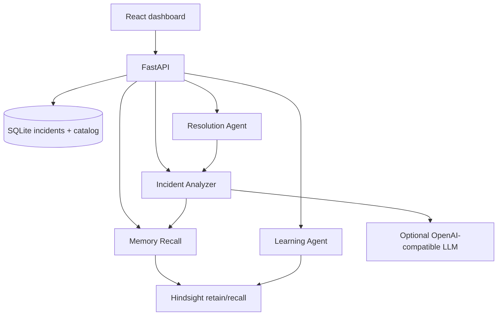

# ResolveIQ

AI incident memory and resolution agent. Every resolved incident becomes organizational memory so the next similar failure is diagnosed with evidence, not guesswork.

This repository is a working MVP. It recommends investigation and resolution; it does not autonomously change production systems.

## Problem

Incident response often restarts from zero. The last outage’s root cause and the fix that actually worked live in Slack threads, tickets, and individual memory. Similar failures keep costing the same time.

## Solution

ResolveIQ closes a memory loop:

```text
new incident → analyze → Hindsight recall → evidence-based recommendation
→ engineer resolves → capture outcome → Hindsight retain → stronger future recall
```

Hindsight is the memory engine (retain / recall). SQLite holds application state (incidents, status, timestamps, a catalog of what was retained). The LLM (optional) reasons over **current evidence + recalled memories** and is forbidden from inventing historical incidents.

## Why memory matters

Without memory, the agent can only parse the current logs. With Hindsight, a Payment API timeout can surface INC-1042 (“database connection pool exhaustion; pool increased 50 → 100; resolved”) and attach that history to the recommendation.

## Architecture



## Hindsight integration

Official Python client (`hindsight-client`):

- `Hindsight(base_url, api_key)`
- `await client.aretain(...)` — store what happened and what worked (`document_id` = incident id)
- `await client.arecall(...)` — retrieve related memories for the current incident
- `create_bank` / `acreate_bank` on startup

All SDK calls live in `backend/app/memory/hindsight_service.py`.

Set `MEMORY_PROVIDER=hindsight` plus `HINDSIGHT_BASE_URL` and `HINDSIGHT_API_KEY` (cloud: `https://api.hindsight.vectorize.io`, key from [Hindsight UI](https://ui.hindsight.vectorize.io); or a local server at `http://localhost:8888`).

`MEMORY_PROVIDER=local` is a **development/test store**. The UI labels it as not Hindsight. It is not keyword-search dressed up as Hindsight in production mode.

If Hindsight is down, the UI shows **Memory service unavailable**.

## Installation

Python 3.11+ and Node.js 18+.

```bash
cd backend
python -m venv .venv
# Windows:
.venv\Scripts\activate
pip install -r requirements.txt

cd ../frontend
npm install
```

## Environment variables

Copy `.env.example` to `.env` in the repo root.

| Variable | Purpose |
|---|---|
| `HINDSIGHT_BASE_URL` | Hindsight API host |
| `HINDSIGHT_API_KEY` | Bearer token for Hindsight Cloud (optional for local server) |
| `HINDSIGHT_BANK_ID` | Memory bank id |
| `LLM_API_KEY` | Optional OpenAI-compatible key |
| `LLM_BASE_URL` | Default `https://api.openai.com/v1` |
| `LLM_MODEL` | Default `gpt-4o-mini` |
| `DATABASE_URL` | Default `sqlite:///./resolveiq.db` |
| `MEMORY_PROVIDER` | `hindsight` or `local` |

## Running locally

Backend (from `backend/`):

```bash
uvicorn app.main:app --reload --port 8000
```

Frontend (from `frontend/`):

```bash
npm run dev
```

Open `http://localhost:5173`. The Vite dev server proxies `/api` to port 8000.

## API

| Method | Path | Description |
|---|---|---|
| GET | `/api/health` | Process, memory provider, LLM flag |
| GET | `/api/stats` | Live counts from this database |
| POST | `/api/incidents` | Create incident |
| GET | `/api/incidents` | List |
| GET | `/api/incidents/{id}` | Detail |
| POST | `/api/incidents/{id}/analyze` | Analyze + recall |
| POST | `/api/incidents/{id}/resolve` | Capture outcome + retain |
| POST | `/api/incidents/{id}/learn` | Re-retain after resolve |
| POST | `/api/memory/recall` | Direct recall |
| GET | `/api/memory` | Catalog search (not Hindsight recall) |
| GET | `/api/memory/{id}` | Catalog payload |
| GET | `/api/patterns` | Recurring pattern counts |
| POST | `/api/demo/launch` | Seed retain + create similar incident |
| POST | `/api/demo/follow-up` | Third similar incident |

## Demo flow

1. Start backend and frontend.
2. Click **Launch Demo**.
3. Historical INC-1042 (Payment API, pool exhaustion, pool 50→100) is already retained.
4. A new Payment API timeout (`payment-v2.4.2`) is created.
5. **Analyze incident** — Hindsight recall should surface INC-1042 / INC-0981 / INC-0877.
6. Expand **Why this recommendation?** and open a historical memory.
7. **Confirm resolution**.
8. Watch **Memory Evolution** (count before → after).
9. **Create follow-up similar incident** and analyze again — the newly retained incident should appear.

## Project structure

```text
ResolveIQ/
  backend/app/          FastAPI, agents, Hindsight service
  backend/tests/        retain/recall, incidents, e2e memory loop
  frontend/src/         React + Tailwind dashboard
  .env.example
```

## Design decisions

- Hindsight stores agent memory; SQLite stores tickets and a retain catalog for the explorer UI (Hindsight recall returns extracted facts, not a full document UI).
- Recommendations always split **current evidence** vs **historical evidence**.
- Relevance percentages are **application ranking** over recalled items, not published retrieval benchmarks.
- Dashboard numbers are **live for this local database** (including seed rows), not claimed production telemetry.
- No auth, paging, Slack, or auto-remediation in this MVP.

## Limitations

- Requires a reachable Hindsight server for real memory (`MEMORY_PROVIDER=hindsight`).
- Without `LLM_API_KEY`, analysis uses a labeled heuristic reasoner.
- Retain is synchronous; large banks may be slow.
- SQLite is single-process; not a multi-region production store.
- Relevance scores are heuristic overlays, not scientific claims.
- The product recommends actions; engineers apply them.

## Future improvements

- Async retain with operation polling
- Per-service memory banks / tags
- Evaluation set for recall quality
- Write-back of “recommendation helped” into mental models
- Read-only links into existing incident tools

## Tests

```bash
cd backend
pytest -q
```

## Screenshots to capture

Dashboard, incident analysis, Hindsight recall list, memory detail, learning / memory evolution, before vs after Hindsight, terminal logs of retain/recall.


## Articles
Article 1 : https://medium.com/@singireddygeethasri/we-gave-our-incident-agent-a-memory-it-wasnt-enough-dce3396bec38

Article 2 : https://medium.com/@ramithasri15/what-happens-when-an-ai-agent-remembers-your-production-incidents-8ddfcef91da6

Reddit post 1: https: //www.reddit.com/r/LLMDevs/s/TwKhJoiX8n 
Reddit Post 2: https://www.reddit.com/r/LLMDevs/s/LnyasnYHXp

LinkedIn Post1: https://lnkd.in/p/dQc4HJU3
linkedin post2 :  https://lnkd.in/p/dVAf_aGg
